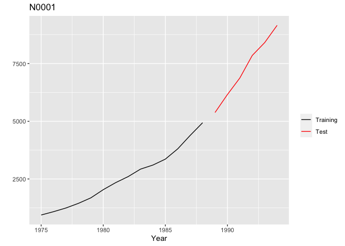
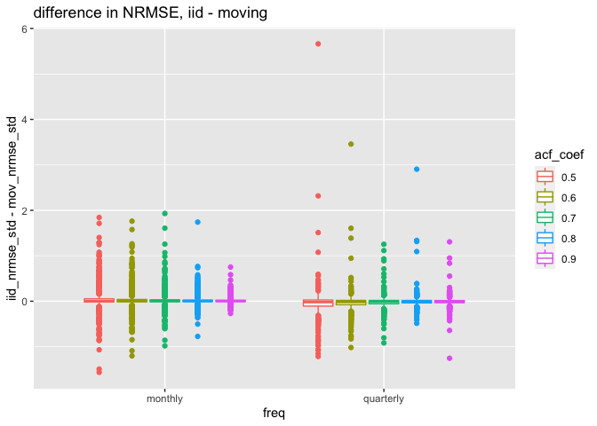
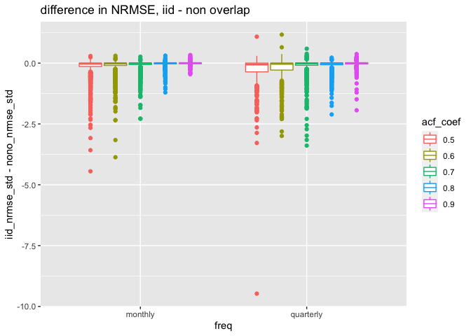
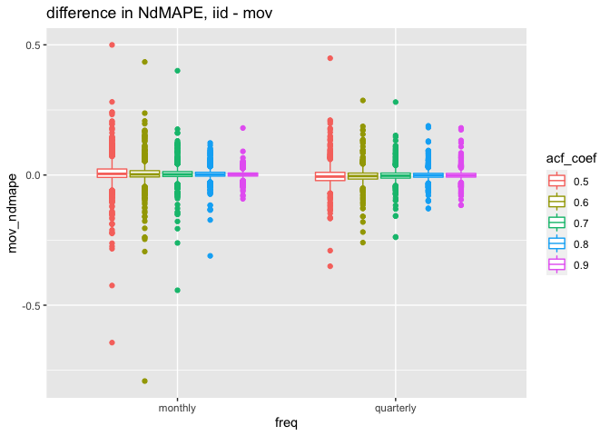
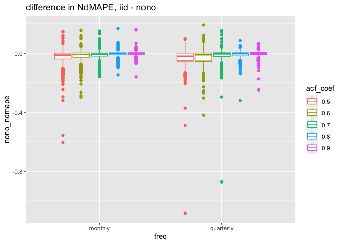
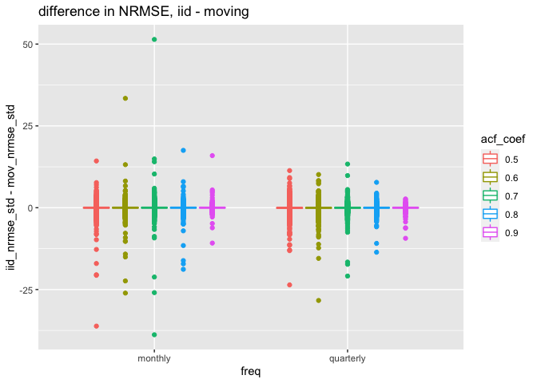
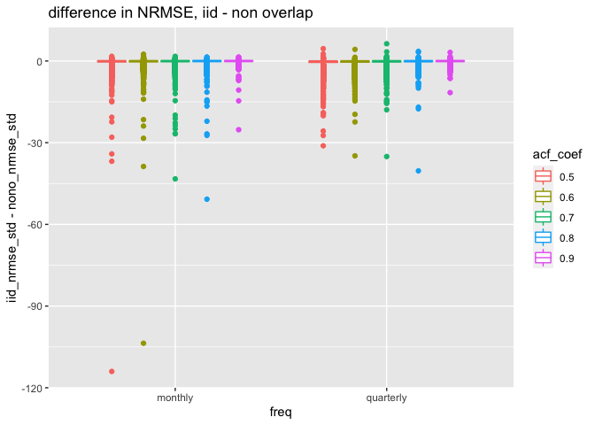
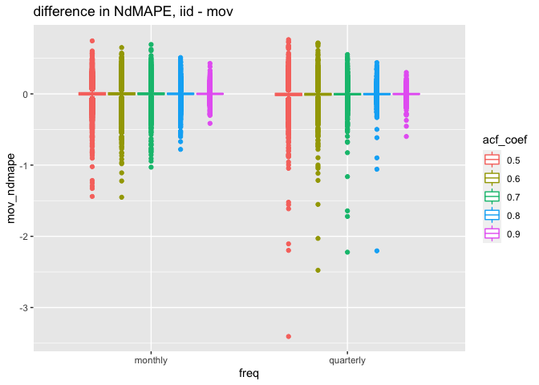
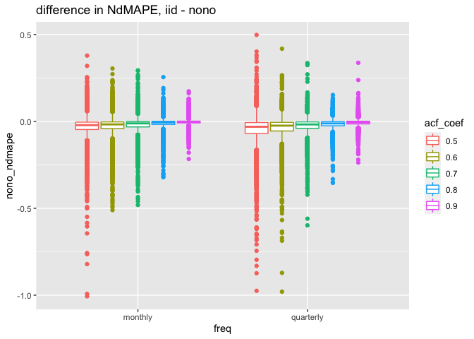
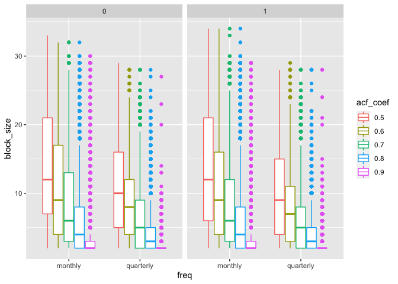

Random forest for dependent data - block bootstrap variants
================

``` r
library(Mcomp)

# # install the M4 data set package if needed
# install.packages("https://github.com/carlanetto/M4comp2018/releases/download/0.2.0/M4comp2018_0.2.0.tar.gz", repos = NULL)
library(M4comp2018)
library(tidyverse)
library(rangerts)
```

## Data set

The data sets we use here are from two of the M-serie time series
forecasting competitions: M3 and M4 data sets, wrapped in two R
packages: **Mcomp** and **M4comp2018**.  
If we take a look at the data set M3:

``` r
M3
```

    ## M-Competition data: 3003 time series 
    ## 
    ##            Type of data
    ## Period      DEMOGRAPHIC FINANCE INDUSTRY MACRO MICRO OTHER Total
    ##   MONTHLY           111     145      334   312   474    52  1428
    ##   OTHER               0      29        0     0     4   141   174
    ##   QUARTERLY          57      76       83   336   204     0   756
    ##   YEARLY            245      58      102    83   146    11   645
    ##   Total             413     308      519   731   828   204  3003

The train and test period are already split in the data set. If we take
one example from the M3 data
set:

``` r
autoplot(M3$N0001)
```

<!-- -->

We note that some of the time series in M competitions are non
stationary.  
In our experiments, we only work with monthly data and quarterly data to
have at least one useful feature (frequency of the series).

``` r
subset(M3, "monthly")
```

    ## M-Competition data: 1428 MONTHLY time series
    ## 
    ##          Type of data
    ## Period    DEMOGRAPHIC FINANCE INDUSTRY MACRO MICRO OTHER
    ##   MONTHLY         111     145      334   312   474    52

The M4 data set is organized in the same manner, but with 100000 time
series and the time series have generally a longer history (more
observations, ~10e3) than the M3 (~10e2).

## Experiment setting

For every time series, we build a standard random forest (with i.i.d
assumption on observations, referred as i.i.d forest later) and two
others with block bootstrap (non-overlapping and moving block bootstrap
variants respectively).

### How to fix block.size

The key parameter **block.size** is determined automatically with the
help of an autocorrelation estimation of the target time series by the
`acf()` function in R. We fix a threshold which varies from 0.5 to 0.9,
and take the largest lag (block.size = 2 if the largest lag is 1,
otherwise this becomes an i.i.d. case). This parameter (threshold) is
names as **acf coefficient** in the following sections. In addition, we
specify `by.end = FALSE` and keep other parameters for the block
bootstrap to default values.  
We obtain the following results.  
Codes of this experiment can be found here: **code here**. Here we show
codes for result analysis with obtained results.

## Results at a glance

We evaluate the performance with two metrics: the normalized RMSE and
the normalized difference of MAPE with respect to the i.i.d. forest.  
The difference in error metrics (i.i.d. - block bootstrap) are presented
below.

### M3 data set:

``` r
res_files <- list.files("results/")
m3_res <- res_files[str_detect(res_files, "m3")]
m3_res <- m3_res[!str_detect(m3_res, "blocksize")]
m3_res <- m3_res[!str_detect(m3_res, "stat")]
m3_res <- m3_res[!str_detect(m3_res, "bis")]
stat_m3 <- read_rds("results/stat_m3.rds")

res <- map_dfr(m3_res,  ~read_rds(paste0("results/", .x)) %>% 
      mutate(acf_coef = str_remove(.x, ".rds"))) %>% 
  mutate(acf_coef = 
           as.numeric(str_sub(acf_coef, start = 4)),
         acf_coef = as.factor(acf_coef)) %>% 
  bind_cols(bind_rows(stat_m3, stat_m3, stat_m3, stat_m3, stat_m3)) %>% 
  mutate(nono_ndmape = (iid_mape - nono_mape) / iid_mape,
         mov_ndmape = (iid_mape - mov_mape) / iid_mape,
         iid_nrmse_std = iid_rmse / std,
         # iid_nrmse_mean = iid_rmse / mean,
         # iid_nrmse_med = iid_rmse / median,
         # iid_rmse_q = iid_rmse / q1_q3,
         nono_nrmse_std = nono_rmse / std,
         # nono_nrmse_mean = nono_rmse / mean,
         # nono_nrmse_med = nono_rmse / median,
         # nono_rmse_q = nono_rmse / q1_q3,
         mov_nrmse_std = mov_rmse / std #,
         # mov_nrmse_mean = mov_rmse / mean,
         # mov_nrmse_med = mov_rmse / median,
         # mov_rmse_q = mov_rmse / q1_q3
         )

coef_acf <- as.numeric(as.character(unique(res$acf_coef)))
```

Here we use the NRMSE (normalized RMSE) and the NdMAPE (normalized
difference of MAPE) as error metrics. We first look at the NRMSE:

\(NRMSE = \frac{RMSE}{\sigma(serie_{train})}\)

and \(\sigma\) is the standard deviation of the training part of the
series to forecast. One may choose to use other ways of normalization
(examples are commented in the above R chuck), but they all show the
same results.

To compare roughly the difference between i.i.d. forest to block
bootstrap forests, here are the boxplots of their difference in NRMSE
and some basic statistics. The boxplots are organized by different acf
coefficients.

#### Moving bootstrap

``` r
ggplot(res, aes(x = freq, y = iid_nrmse_std - mov_nrmse_std, color = acf_coef)) +
  geom_boxplot() + 
  labs(title = "difference in NRMSE, iid - moving")
```

<!-- -->

``` r
res %>% 
  group_by(freq, acf_coef) %>% 
  summarise(min = summary(iid_nrmse_std - mov_nrmse_std)[1],
            q1 = summary(iid_nrmse_std - mov_nrmse_std)[2],
            med = summary(iid_nrmse_std - mov_nrmse_std)[3],
            mean = summary(iid_nrmse_std - mov_nrmse_std)[4],
            q3 = summary(iid_nrmse_std - mov_nrmse_std)[5],
            max = summary(iid_nrmse_std - mov_nrmse_std)[6])
```

    ## `summarise()` has grouped output by 'freq'. You can override using the `.groups` argument.

    ## # A tibble: 10 x 8
    ## # Groups:   freq [2]
    ##    freq     acf_coef min       q1         med        mean       q3       max    
    ##    <chr>    <fct>    <table>   <table>    <table>    <table>    <table>  <table>
    ##  1 monthly  0.5      -1.56419… -0.016440…  0.004928…  0.031854… 0.05351… 1.8425…
    ##  2 monthly  0.6      -1.20252… -0.011772…  0.005408…  0.029117… 0.03788… 1.7614…
    ##  3 monthly  0.7      -0.98228… -0.009447…  0.004152…  0.024489… 0.03093… 1.9298…
    ##  4 monthly  0.8      -0.77469… -0.007749…  0.003647…  0.020573… 0.02502… 1.7407…
    ##  5 monthly  0.9      -0.26986… -0.006825…  0.003329…  0.012640… 0.02072… 0.7516…
    ##  6 quarter… 0.5      -1.21573… -0.107297… -0.019866… -0.047910… 0.02683… 5.6621…
    ##  7 quarter… 0.6      -1.01842… -0.076910… -0.016494… -0.035290… 0.01849… 3.4572…
    ##  8 quarter… 0.7      -0.91805… -0.056481… -0.011682… -0.021324… 0.01738… 1.2534…
    ##  9 quarter… 0.8      -0.48608… -0.036924… -0.007116… -0.003821… 0.01729… 2.9045…
    ## 10 quarter… 0.9      -1.25464… -0.032678… -0.007164… -0.010337… 0.01504… 1.3064…

The difference is quite centered, which indicates that the block
bootstrap variants improves the forecasting result only in some of the
M3 data set. We also observe an impact of the acf coefficient on the
performance. Note that with a larger acf coefficient, we are more likely
to have a small block.size (for example for acf coefficient = 0.9, we
will have block.size = 2 in many cases and thus very close to the i.i.d.
case).

#### Non-overlapping bootstrap

``` r
ggplot(res, aes(x = freq, y = iid_nrmse_std - nono_nrmse_std, color = acf_coef)) +
  geom_boxplot() + 
  labs(title = "difference in NRMSE, iid - non overlap")
```

<!-- -->

``` r
res %>% 
  group_by(freq, acf_coef) %>% 
  summarise(min = summary(iid_nrmse_std - nono_nrmse_std)[1],
            q1 = summary(iid_nrmse_std - nono_nrmse_std)[2],
            med = summary(iid_nrmse_std - nono_nrmse_std)[3],
            mean = summary(iid_nrmse_std - nono_nrmse_std)[4],
            q3 = summary(iid_nrmse_std - nono_nrmse_std)[5],
            max = summary(iid_nrmse_std - nono_nrmse_std)[6])
```

    ## `summarise()` has grouped output by 'freq'. You can override using the `.groups` argument.

    ## # A tibble: 10 x 8
    ## # Groups:   freq [2]
    ##    freq     acf_coef min       q1         med        mean      q3        max    
    ##    <chr>    <fct>    <table>   <table>    <table>    <table>   <table>   <table>
    ##  1 monthly  0.5      -4.44627… -0.141339… -0.024439… -0.16257… 0.000155… 0.2916…
    ##  2 monthly  0.6      -3.86790… -0.095998… -0.013196… -0.11899… 0.001646… 0.3001…
    ##  3 monthly  0.7      -2.28753… -0.058346… -0.010003… -0.08002… 0.002264… 0.2636…
    ##  4 monthly  0.8      -1.20497… -0.028661… -0.005318… -0.03544… 0.003863… 0.3065…
    ##  5 monthly  0.9      -0.46111… -0.020884… -0.003088… -0.01309… 0.005585… 0.3300…
    ##  6 quarter… 0.5      -9.47502… -0.361275… -0.057021… -0.26359… 0.002212… 1.0857…
    ##  7 quarter… 0.6      -2.99336… -0.285854… -0.027435… -0.23286… 0.001910… 1.1716…
    ##  8 quarter… 0.7      -3.38890… -0.089909… -0.012433… -0.12613… 0.006073… 0.5910…
    ##  9 quarter… 0.8      -2.10991… -0.068464… -0.008337… -0.09547… 0.006820… 0.2247…
    ## 10 quarter… 0.9      -1.93794… -0.037283… -0.003821… -0.02474… 0.014401… 0.3723…

Generally, the moving variant outperforms the non-overlapping variant
with the M3 data set. We observe gain with moving variant on monthly
data.

### Test of significance

Next, we perform the Wilcoxon test to see if the difference in NRMSE
between i.i.d. forest and the variants is significant. The alternative
hypothesis is that true location shift is greater than 0 =\> variant
better than i.i.d.

``` r
wilcoxon_mov  <- c()
wilcoxon_nono <- c()

for (acf in coef_acf) {
  
  for (frequen in c("monthly", "quarterly")) {
    
    # cat("Test for results with acf_coef =", acf, frequen, "data", "\n")
    res_nrmse_std <- res %>% 
      filter(!is.infinite(iid_nrmse_std)) %>% 
      filter(acf_coef == acf, 
             freq == frequen)
    
    # cat("------------------------- Moving -------------------------\n")
    test_mov <- wilcox.test(x = res_nrmse_std$iid_nrmse_std,
                            y = res_nrmse_std$mov_nrmse_std, 
                            paired = T, alternative = "greater")
    # print(test_mov)
    wilcoxon_mov <- c(wilcoxon_mov, test_mov$p.value)
    
    # cat("------------------------- Non-over -----------------------\n")
    test_nono <- wilcox.test(x = res_nrmse_std$iid_nrmse_std,
                             y = res_nrmse_std$nono_nrmse_std, 
                             paired = T, alternative = "greater")
    # print(test_nono)
    wilcoxon_nono <- c(wilcoxon_nono, test_nono$p.value)
    
    # cat("----------------------------------------------------------\n")
  }
  
}


res %>% 
  group_by(acf_coef, freq) %>% 
  summarise(median = summary(iid_nrmse_std - mov_nrmse_std)[3],
            mean = summary(iid_nrmse_std - mov_nrmse_std)[4]) %>% 
  bind_cols(tibble(p_value = wilcoxon_mov))
```

    ## `summarise()` has grouped output by 'acf_coef'. You can override using the `.groups` argument.

    ## # A tibble: 10 x 5
    ## # Groups:   acf_coef [5]
    ##    acf_coef freq      median       mean          p_value
    ##    <fct>    <chr>     <table>      <table>         <dbl>
    ##  1 0.5      monthly    0.004928949  0.031854396 7.48e-13
    ##  2 0.5      quarterly -0.019866390 -0.047910450 1   e+ 0
    ##  3 0.6      monthly    0.005408670  0.029117200 2.09e-16
    ##  4 0.6      quarterly -0.016494110 -0.035290260 1   e+ 0
    ##  5 0.7      monthly    0.004152221  0.024489655 1.71e-18
    ##  6 0.7      quarterly -0.011682340 -0.021324364 1.00e+ 0
    ##  7 0.8      monthly    0.003647448  0.020573272 4.29e-20
    ##  8 0.8      quarterly -0.007116864 -0.003821496 1.00e+ 0
    ##  9 0.9      monthly    0.003329920  0.012640817 6.12e-19
    ## 10 0.9      quarterly -0.007164270 -0.010337412 1.00e+ 0

``` r
res %>% 
  group_by(acf_coef, freq) %>% 
  summarise(median = summary(iid_nrmse_std - nono_nrmse_std)[3],
            mean = summary(iid_nrmse_std - nono_nrmse_std)[4]) %>% 
  bind_cols(tibble(p_value = wilcoxon_nono))
```

    ## `summarise()` has grouped output by 'acf_coef'. You can override using the `.groups` argument.

    ## # A tibble: 10 x 5
    ## # Groups:   acf_coef [5]
    ##    acf_coef freq      median       mean        p_value
    ##    <fct>    <chr>     <table>      <table>       <dbl>
    ##  1 0.5      monthly   -0.024439070 -0.16257424    1   
    ##  2 0.5      quarterly -0.057021887 -0.26359921    1   
    ##  3 0.6      monthly   -0.013196387 -0.11899420    1   
    ##  4 0.6      quarterly -0.027435061 -0.23286837    1   
    ##  5 0.7      monthly   -0.010003234 -0.08002058    1   
    ##  6 0.7      quarterly -0.012433070 -0.12613279    1   
    ##  7 0.8      monthly   -0.005318703 -0.03544080    1   
    ##  8 0.8      quarterly -0.008337062 -0.09547608    1   
    ##  9 0.9      monthly   -0.003088552 -0.01309895    1   
    ## 10 0.9      quarterly -0.003821941 -0.02474410    1.00

By the Wilcoxon test, we confirm that the gain observed with moving
variant on monthly is statistically significant.

Now we evaluate in terms of the normalized difference in MAPE where:

\(NdMAPE = \frac{\Delta (MAPE)}{MAPE_{i.i.d.}}\)

and \(\Delta (MAPE) = MAPE_{i.i.d.} - MAPE_{variant}\) is the difference
between the i.i.d. forest and the block bootstrap variant.

We show the boxplots of their difference in NdMAPE and also the basic
statistics:

``` r
ggplot(res, aes(x = freq, y = mov_ndmape, color = acf_coef)) +
  geom_boxplot() + 
  labs(title = "difference in NdMAPE, iid - mov")
```

<!-- -->

``` r
res %>% 
  group_by(freq, acf_coef) %>% 
  summarise(min = summary(mov_ndmape)[1],
            q1 = summary(mov_ndmape)[2],
            med = summary(mov_ndmape)[3],
            mean = summary(mov_ndmape)[4],
            q3 = summary(mov_ndmape)[5],
            max = summary(mov_ndmape)[6])
```

    ## `summarise()` has grouped output by 'freq'. You can override using the `.groups` argument.

    ## # A tibble: 10 x 8
    ## # Groups:   freq [2]
    ##    freq     acf_coef min       q1         med        mean       q3       max    
    ##    <chr>    <fct>    <table>   <table>    <table>    <table>    <table>  <table>
    ##  1 monthly  0.5      -0.64368… -0.009132…  0.004451…  0.007740… 0.02314… 0.4997…
    ##  2 monthly  0.6      -0.79131… -0.007454…  0.002539…  0.005441… 0.01654… 0.4343…
    ##  3 monthly  0.7      -0.44255… -0.005606…  0.002674…  0.004466… 0.01315… 0.4006…
    ##  4 monthly  0.8      -0.31045… -0.004343…  0.002283…  0.003132… 0.01047… 0.1231…
    ##  5 monthly  0.9      -0.09150… -0.004048…  0.001487…  0.001881… 0.00766… 0.1805…
    ##  6 quarter… 0.5      -0.35036… -0.021411… -0.006055… -0.003767… 0.01030… 0.4486…
    ##  7 quarter… 0.6      -0.25942… -0.015449… -0.004143… -0.002248… 0.00739… 0.2864…
    ##  8 quarter… 0.7      -0.23906… -0.011934… -0.002726… -0.001423… 0.00745… 0.2801…
    ##  9 quarter… 0.8      -0.12912… -0.008449… -0.000988… -0.000167… 0.00641… 0.1889…
    ## 10 quarter… 0.9      -0.11617… -0.007914… -0.001337… -0.000174… 0.00613… 0.1809…

``` r
ggplot(res, aes(x = freq, y = nono_ndmape, color = acf_coef)) +
  geom_boxplot() + 
  labs(title = "difference in NdMAPE, iid - nono")
```

<!-- -->

``` r
res %>% 
  group_by(freq, acf_coef) %>% 
  summarise(min = summary(nono_ndmape)[1],
            q1 = summary(nono_ndmape)[2],
            med = summary(nono_ndmape)[3],
            mean = summary(nono_ndmape)[4],
            q3 = summary(nono_ndmape)[5],
            max = summary(nono_ndmape)[6])
```

    ## `summarise()` has grouped output by 'freq'. You can override using the `.groups` argument.

    ## # A tibble: 10 x 8
    ## # Groups:   freq [2]
    ##    freq     acf_coef min       q1         med       mean      q3        max     
    ##    <chr>    <fct>    <table>   <table>    <table>   <table>   <table>   <table> 
    ##  1 monthly  0.5      -0.60444… -0.039794… -0.01289… -0.02595… 0.000410… 0.14811…
    ##  2 monthly  0.6      -0.29558… -0.027745… -0.00900… -0.01751… 0.001612… 0.15583…
    ##  3 monthly  0.7      -0.15783… -0.020025… -0.00619… -0.01133… 0.001243… 0.14991…
    ##  4 monthly  0.8      -0.14629… -0.011260… -0.00336… -0.00491… 0.002529… 0.16827…
    ##  5 monthly  0.9      -0.15978… -0.007734… -0.00165… -0.00235… 0.003427… 0.16030…
    ##  6 quarter… 0.5      -1.08440… -0.051746… -0.02055… -0.03322… 0.000487… 0.09914…
    ##  7 quarter… 0.6      -0.42102… -0.052747… -0.01079… -0.02774… 0.001065… 0.19139…
    ##  8 quarter… 0.7      -0.87176… -0.021671… -0.00462… -0.01442… 0.002821… 0.15248…
    ##  9 quarter… 0.8      -0.32008… -0.018318… -0.00328… -0.01079… 0.002801… 0.08660…
    ## 10 quarter… 0.9      -0.24784… -0.009607… -0.00164… -0.00414… 0.004600… 0.06767…

We have the same conclusion as the NRMSR metric. Now again, we use the
Wilcoxon test to see if the difference in NdMAPE between i.i.d. forest
and the variants is significant.

``` r
wilcoxon_mov  <- c()
wilcoxon_nono <- c()

for (acf in coef_acf) {
  
  for (frequen in c("monthly", "quarterly")) {
    
    # cat("Test for results with acf_coef =", acf, frequen, "data", "\n")
    res_ndmape <- res %>% 
      filter(!is.infinite(mov_ndmape)) %>% 
      filter(acf_coef == acf, 
             freq == frequen)
    
    # cat("------------------------- Moving -------------------------\n")
    test_mov <- wilcox.test(x = res_ndmape$mov_ndmape, alternative = "greater")
    # print(test_mov)
    wilcoxon_mov <- c(wilcoxon_mov, test_mov$p.value)
    
    # cat("------------------------- Non-over -----------------------\n")
    test_nono <- wilcox.test(x = res_ndmape$nono_ndmape, alternative = "greater")
    # print(test_nono)
    wilcoxon_nono <- c(wilcoxon_nono, test_nono$p.value)
    
    # cat("----------------------------------------------------------\n")
  }
  
}

res %>% 
  group_by(acf_coef, freq) %>% 
  summarise(median = summary(mov_ndmape)[3],
            mean = summary(mov_ndmape)[4]) %>% 
  bind_cols(tibble(p_value = wilcoxon_mov))
```

    ## `summarise()` has grouped output by 'acf_coef'. You can override using the `.groups` argument.

    ## # A tibble: 10 x 5
    ## # Groups:   acf_coef [5]
    ##    acf_coef freq      median        mean           p_value
    ##    <fct>    <chr>     <table>       <table>          <dbl>
    ##  1 0.5      monthly    0.0044515262  0.0077405199 8.40e-16
    ##  2 0.5      quarterly -0.0060550569 -0.0037678246 1.00e+ 0
    ##  3 0.6      monthly    0.0025399502  0.0054414483 1.07e-13
    ##  4 0.6      quarterly -0.0041436350 -0.0022484961 1.00e+ 0
    ##  5 0.7      monthly    0.0026749533  0.0044665263 9.55e-17
    ##  6 0.7      quarterly -0.0027267136 -0.0014237534 1.00e+ 0
    ##  7 0.8      monthly    0.0022830017  0.0031327313 3.33e-17
    ##  8 0.8      quarterly -0.0009880936 -0.0001675326 9.80e- 1
    ##  9 0.9      monthly    0.0014878766  0.0018817774 3.45e-11
    ## 10 0.9      quarterly -0.0013376597 -0.0001744466 9.87e- 1

``` r
res %>% 
  group_by(acf_coef, freq) %>% 
  summarise(median = summary(nono_ndmape)[3],
            mean = summary(nono_ndmape)[4]) %>% 
  bind_cols(tibble(p_value = wilcoxon_nono))
```

    ## `summarise()` has grouped output by 'acf_coef'. You can override using the `.groups` argument.

    ## # A tibble: 10 x 5
    ## # Groups:   acf_coef [5]
    ##    acf_coef freq      median       mean         p_value
    ##    <fct>    <chr>     <table>      <table>        <dbl>
    ##  1 0.5      monthly   -0.012894505 -0.025955457    1   
    ##  2 0.5      quarterly -0.020553382 -0.033225319    1   
    ##  3 0.6      monthly   -0.009003093 -0.017513117    1   
    ##  4 0.6      quarterly -0.010795553 -0.027746003    1   
    ##  5 0.7      monthly   -0.006190929 -0.011330896    1   
    ##  6 0.7      quarterly -0.004626803 -0.014426383    1   
    ##  7 0.8      monthly   -0.003364038 -0.004913140    1   
    ##  8 0.8      quarterly -0.003285855 -0.010797004    1   
    ##  9 0.9      monthly   -0.001656240 -0.002355830    1   
    ## 10 0.9      quarterly -0.001641728 -0.004140803    1.00

## Some additional results

The percentage of cases where the block bootstrap variant is doing
better than the i.i.d. (in terms of NdMAPE):

``` r
res %>% 
  group_by(freq, acf_coef) %>% 
  summarise(percentage = sum(as.numeric(mov_ndmape > 0)) / n())
```

    ## `summarise()` has grouped output by 'freq'. You can override using the `.groups` argument.

    ## # A tibble: 10 x 3
    ## # Groups:   freq [2]
    ##    freq      acf_coef percentage
    ##    <chr>     <fct>         <dbl>
    ##  1 monthly   0.5           0.581
    ##  2 monthly   0.6           0.567
    ##  3 monthly   0.7           0.589
    ##  4 monthly   0.8           0.586
    ##  5 monthly   0.9           0.572
    ##  6 quarterly 0.5           0.406
    ##  7 quarterly 0.6           0.394
    ##  8 quarterly 0.7           0.426
    ##  9 quarterly 0.8           0.447
    ## 10 quarterly 0.9           0.446

``` r
res %>% 
  group_by(freq, acf_coef) %>% 
  summarise(percentage = sum(as.numeric(nono_ndmape > 0)) / n())
```

    ## `summarise()` has grouped output by 'freq'. You can override using the `.groups` argument.

    ## # A tibble: 10 x 3
    ## # Groups:   freq [2]
    ##    freq      acf_coef percentage
    ##    <chr>     <fct>         <dbl>
    ##  1 monthly   0.5           0.259
    ##  2 monthly   0.6           0.294
    ##  3 monthly   0.7           0.296
    ##  4 monthly   0.8           0.352
    ##  5 monthly   0.9           0.406
    ##  6 quarterly 0.5           0.265
    ##  7 quarterly 0.6           0.282
    ##  8 quarterly 0.7           0.343
    ##  9 quarterly 0.8           0.361
    ## 10 quarterly 0.9           0.433

The average block size with better results:

``` r
res_with_idx <- res %>%
  nest(data = !freq) %>% 
  mutate(data_t = lapply(data, function(x) {
    x %>% mutate(idx = rep(1:(nrow(x) / 5), times = 5))
  })) %>% 
  unnest(data_t) %>% 
  select(- data)


blocksize_m3 <- readRDS("results/blocksize_m3.rds")

res_with_idx <- res_with_idx %>% 
  left_join(blocksize_m3 %>% 
              mutate(acf_coef = as.factor(niveau_acf)) %>% 
              select(- niveau_acf), 
            by = c("acf_coef", "idx"))

res_with_idx %>% 
  mutate(better_with_mov = as.numeric(mov_nrmse_std > 0)) %>% 
  group_by(acf_coef, better_with_mov, freq) %>% 
  summarise(mean_block_size = mean(block_size))
```

    ## `summarise()` has grouped output by 'acf_coef', 'better_with_mov'. You can override using the `.groups` argument.

    ## # A tibble: 10 x 4
    ## # Groups:   acf_coef, better_with_mov [5]
    ##    acf_coef better_with_mov freq      mean_block_size
    ##    <fct>              <dbl> <chr>               <dbl>
    ##  1 0.5                    1 monthly              5.63
    ##  2 0.5                    1 quarterly            5.19
    ##  3 0.6                    1 monthly              4.11
    ##  4 0.6                    1 quarterly            4.11
    ##  5 0.7                    1 monthly              2.98
    ##  6 0.7                    1 quarterly            3.13
    ##  7 0.8                    1 monthly              2.27
    ##  8 0.8                    1 quarterly            2.31
    ##  9 0.9                    1 monthly              2.01
    ## 10 0.9                    1 quarterly            2.01

``` r
res_with_idx %>% 
  mutate(better_with_nono = as.numeric(nono_nrmse_std > 0)) %>% 
  group_by(acf_coef, better_with_nono, freq) %>% 
  summarise(mean_block_size = mean(block_size))
```

    ## `summarise()` has grouped output by 'acf_coef', 'better_with_nono'. You can override using the `.groups` argument.

    ## # A tibble: 10 x 4
    ## # Groups:   acf_coef, better_with_nono [5]
    ##    acf_coef better_with_nono freq      mean_block_size
    ##    <fct>               <dbl> <chr>               <dbl>
    ##  1 0.5                     1 monthly              5.63
    ##  2 0.5                     1 quarterly            5.19
    ##  3 0.6                     1 monthly              4.11
    ##  4 0.6                     1 quarterly            4.11
    ##  5 0.7                     1 monthly              2.98
    ##  6 0.7                     1 quarterly            3.13
    ##  7 0.8                     1 monthly              2.27
    ##  8 0.8                     1 quarterly            2.31
    ##  9 0.9                     1 monthly              2.01
    ## 10 0.9                     1 quarterly            2.01

``` r
res_with_idx %>% 
  mutate(better_with_mov = as.numeric(mov_ndmape > 0)) %>% 
  group_by(acf_coef, better_with_mov, freq) %>% 
  summarise(mean_block_size = mean(block_size))
```

    ## `summarise()` has grouped output by 'acf_coef', 'better_with_mov'. You can override using the `.groups` argument.

    ## # A tibble: 20 x 4
    ## # Groups:   acf_coef, better_with_mov [10]
    ##    acf_coef better_with_mov freq      mean_block_size
    ##    <fct>              <dbl> <chr>               <dbl>
    ##  1 0.5                    0 monthly              6.05
    ##  2 0.5                    0 quarterly            5.45
    ##  3 0.5                    1 monthly              5.32
    ##  4 0.5                    1 quarterly            4.80
    ##  5 0.6                    0 monthly              4.33
    ##  6 0.6                    0 quarterly            4.24
    ##  7 0.6                    1 monthly              3.94
    ##  8 0.6                    1 quarterly            3.91
    ##  9 0.7                    0 monthly              3.08
    ## 10 0.7                    0 quarterly            3.16
    ## 11 0.7                    1 monthly              2.92
    ## 12 0.7                    1 quarterly            3.08
    ## 13 0.8                    0 monthly              2.35
    ## 14 0.8                    0 quarterly            2.33
    ## 15 0.8                    1 monthly              2.20
    ## 16 0.8                    1 quarterly            2.28
    ## 17 0.9                    0 monthly              2.01
    ## 18 0.9                    0 quarterly            2.00
    ## 19 0.9                    1 monthly              2.01
    ## 20 0.9                    1 quarterly            2.03

``` r
res_with_idx %>% 
  mutate(better_with_nono = as.numeric(nono_ndmape > 0)) %>% 
  group_by(acf_coef, better_with_nono, freq) %>% 
  summarise(mean_block_size = mean(block_size))
```

    ## `summarise()` has grouped output by 'acf_coef', 'better_with_nono'. You can override using the `.groups` argument.

    ## # A tibble: 20 x 4
    ## # Groups:   acf_coef, better_with_nono [10]
    ##    acf_coef better_with_nono freq      mean_block_size
    ##    <fct>               <dbl> <chr>               <dbl>
    ##  1 0.5                     0 monthly              5.61
    ##  2 0.5                     0 quarterly            5.69
    ##  3 0.5                     1 monthly              5.68
    ##  4 0.5                     1 quarterly            3.78
    ##  5 0.6                     0 monthly              3.98
    ##  6 0.6                     0 quarterly            4.46
    ##  7 0.6                     1 monthly              4.41
    ##  8 0.6                     1 quarterly            3.20
    ##  9 0.7                     0 monthly              2.91
    ## 10 0.7                     0 quarterly            3.24
    ## 11 0.7                     1 monthly              3.16
    ## 12 0.7                     1 quarterly            2.90
    ## 13 0.8                     0 monthly              2.27
    ## 14 0.8                     0 quarterly            2.40
    ## 15 0.8                     1 monthly              2.26
    ## 16 0.8                     1 quarterly            2.15
    ## 17 0.9                     0 monthly              2.01
    ## 18 0.9                     0 quarterly            2.01
    ## 19 0.9                     1 monthly              2.02
    ## 20 0.9                     1 quarterly            2.02

### M4 data set:

We perform the same analysis with the M4 data set. In short, we have the
same conclusion as for the M3 data set that the moving variant has
better performance on monthly data.

Visualization of error metric
differences.

``` r
ggplot(res, aes(x = freq, y = iid_nrmse_std - mov_nrmse_std, color = acf_coef)) +
  geom_boxplot() + 
  labs(title = "difference in NRMSE, iid - moving")
```

    ## Warning: Removed 200 rows containing non-finite values (stat_boxplot).

<!-- -->

``` r
# we show some basic statistics
res %>% 
  group_by(freq, acf_coef) %>% 
  summarise(min = summary(iid_nrmse_std - mov_nrmse_std)[1],
            q1 = summary(iid_nrmse_std - mov_nrmse_std)[2],
            med = summary(iid_nrmse_std - mov_nrmse_std)[3],
            mean = summary(iid_nrmse_std - mov_nrmse_std)[4],
            q3 = summary(iid_nrmse_std - mov_nrmse_std)[5],
            max = summary(iid_nrmse_std - mov_nrmse_std)[6])
```

    ## `summarise()` has grouped output by 'freq'. You can override using the `.groups` argument.

    ## # A tibble: 10 x 8
    ## # Groups:   freq [2]
    ##    freq     acf_coef min       q1         med        mean       q3       max    
    ##    <chr>    <fct>    <table>   <table>    <table>    <table>    <table>  <table>
    ##  1 monthly  0.5      -36.1758… -0.068456… -0.001301… -0.011637… 0.06497… 14.285…
    ##  2 monthly  0.6      -26.0787… -0.053820… -0.000386… -0.005043… 0.05800… 33.419…
    ##  3 monthly  0.7      -38.8109… -0.039079…  0.000260…  0.000284… 0.04779… 51.420…
    ##  4 monthly  0.8      -18.8218… -0.024014…  0.000634…  0.002257… 0.03291… 17.520…
    ##  5 monthly  0.9      -10.8094… -0.014364…  0.000479…  0.003889… 0.01940… 15.920…
    ##  6 quarter… 0.5      -23.5815… -0.155110… -0.029861… -0.079839… 0.02874… 11.345…
    ##  7 quarter… 0.6      -28.3391… -0.119927… -0.021604… -0.062911… 0.02298… 10.136…
    ##  8 quarter… 0.7      -20.8825… -0.083606… -0.014340… -0.042521… 0.01965… 13.341…
    ##  9 quarter… 0.8      -13.5981… -0.055561… -0.010129… -0.028427… 0.01523…  7.754…
    ## 10 quarter… 0.9       -9.3454… -0.035407… -0.006240… -0.014996… 0.01466…  2.682…

``` r
ggplot(res, aes(x = freq, y = iid_nrmse_std - nono_nrmse_std, color = acf_coef)) +
  geom_boxplot() + 
  labs(title = "difference in NRMSE, iid - non overlap")
```

    ## Warning: Removed 200 rows containing non-finite values (stat_boxplot).

<!-- -->

``` r
res %>% 
  group_by(freq, acf_coef) %>% 
  summarise(min = summary(iid_nrmse_std - nono_nrmse_std)[1],
            q1 = summary(iid_nrmse_std - nono_nrmse_std)[2],
            med = summary(iid_nrmse_std - nono_nrmse_std)[3],
            mean = summary(iid_nrmse_std - nono_nrmse_std)[4],
            q3 = summary(iid_nrmse_std - nono_nrmse_std)[5],
            max = summary(iid_nrmse_std - nono_nrmse_std)[6])
```

    ## `summarise()` has grouped output by 'freq'. You can override using the `.groups` argument.

    ## # A tibble: 10 x 8
    ## # Groups:   freq [2]
    ##    freq     acf_coef min       q1         med       mean      q3         max    
    ##    <chr>    <fct>    <table>   <table>    <table>   <table>   <table>    <table>
    ##  1 monthly  0.5      -114.009… -0.293075… -0.08057… -0.23974… -0.007459… 1.7212…
    ##  2 monthly  0.6      -103.655… -0.249243… -0.06173… -0.21457… -0.004915… 2.4960…
    ##  3 monthly  0.7       -43.289… -0.183551… -0.03833… -0.17001… -0.001818… 1.7153…
    ##  4 monthly  0.8       -50.748… -0.099407… -0.01867… -0.11315…  0.000889… 1.4370…
    ##  5 monthly  0.9       -25.230… -0.042526… -0.00764… -0.04343…  0.003619… 1.4596…
    ##  6 quarter… 0.5       -31.136… -0.534741… -0.15924… -0.45592… -0.018256… 4.5218…
    ##  7 quarter… 0.6       -34.838… -0.419697… -0.12513… -0.37003… -0.012764… 4.2524…
    ##  8 quarter… 0.7       -35.081… -0.315104… -0.08589… -0.27858… -0.007097… 6.3291…
    ##  9 quarter… 0.8       -40.341… -0.189288… -0.05353… -0.17664… -0.003377… 3.5482…
    ## 10 quarter… 0.9       -11.607… -0.103724… -0.02360… -0.08330…  0.002375… 3.1659…

We perform the Wilcoxon test to see if the difference in NRMSE between
i.i.d. forest and the variants is significant.

``` r
wilcoxon_mov  <- c()
wilcoxon_nono <- c()

for (acf in coef_acf) {
  
  for (frequen in c("monthly", "quarterly")) {
    
    # cat("Test for results with acf_coef =", acf, frequen, "data", "\n")
    res_nrmse_std <- res %>% 
      filter(!is.infinite(iid_nrmse_std)) %>% 
      filter(acf_coef == acf, 
             freq == frequen)
    
    # cat("------------------------- Moving -------------------------\n")
    test_mov <- wilcox.test(x = res_nrmse_std$iid_nrmse_std,
                            y = res_nrmse_std$mov_nrmse_std, 
                            paired = T, alternative = "greater")
    # print(test_mov)
    wilcoxon_mov <- c(wilcoxon_mov, test_mov$p.value)
    
    # cat("------------------------- Non-over -----------------------\n")
    test_nono <- wilcox.test(x = res_nrmse_std$iid_nrmse_std,
                             y = res_nrmse_std$nono_nrmse_std, 
                             paired = T, alternative = "greater")
    # print(test_nono)
    wilcoxon_nono <- c(wilcoxon_nono, test_nono$p.value)
    
    # cat("----------------------------------------------------------\n")
  }
  
}


res %>% 
  group_by(acf_coef, freq) %>% 
  summarise(median = summary(iid_nrmse_std - mov_nrmse_std)[3],
            mean = summary(iid_nrmse_std - mov_nrmse_std)[4]) %>% 
  bind_cols(tibble(p_value = wilcoxon_mov))
```

    ## `summarise()` has grouped output by 'acf_coef'. You can override using the `.groups` argument.

    ## # A tibble: 10 x 5
    ## # Groups:   acf_coef [5]
    ##    acf_coef freq      median        mean           p_value
    ##    <fct>    <chr>     <table>       <table>          <dbl>
    ##  1 0.5      monthly   -0.0013015085 -0.0116375864 1.00e+ 0
    ##  2 0.5      quarterly -0.0298612602 -0.0798392738 1   e+ 0
    ##  3 0.6      monthly   -0.0003862796 -0.0050437887 3.73e- 1
    ##  4 0.6      quarterly -0.0216048304 -0.0629118614 1   e+ 0
    ##  5 0.7      monthly    0.0002606306  0.0002843246 2.83e- 6
    ##  6 0.7      quarterly -0.0143401748 -0.0425217157 1   e+ 0
    ##  7 0.8      monthly    0.0006347208  0.0022571324 2.55e-19
    ##  8 0.8      quarterly -0.0101298308 -0.0284272368 1   e+ 0
    ##  9 0.9      monthly    0.0004790157  0.0038894782 5.78e-29
    ## 10 0.9      quarterly -0.0062401121 -0.0149967727 1   e+ 0

``` r
res %>% 
  group_by(acf_coef, freq) %>% 
  summarise(median = summary(iid_nrmse_std - nono_nrmse_std)[3],
            mean = summary(iid_nrmse_std - nono_nrmse_std)[4]) %>% 
  bind_cols(tibble(p_value = wilcoxon_nono))
```

    ## `summarise()` has grouped output by 'acf_coef'. You can override using the `.groups` argument.

    ## # A tibble: 10 x 5
    ## # Groups:   acf_coef [5]
    ##    acf_coef freq      median       mean        p_value
    ##    <fct>    <chr>     <table>      <table>       <dbl>
    ##  1 0.5      monthly   -0.080574357 -0.23974112       1
    ##  2 0.5      quarterly -0.159240694 -0.45592601       1
    ##  3 0.6      monthly   -0.061737542 -0.21457383       1
    ##  4 0.6      quarterly -0.125137936 -0.37003294       1
    ##  5 0.7      monthly   -0.038330940 -0.17001712       1
    ##  6 0.7      quarterly -0.085897511 -0.27858495       1
    ##  7 0.8      monthly   -0.018671853 -0.11315907       1
    ##  8 0.8      quarterly -0.053539416 -0.17664239       1
    ##  9 0.9      monthly   -0.007647864 -0.04343011       1
    ## 10 0.9      quarterly -0.023603035 -0.08330151       1

We show the boxplots of their difference in NdMAPE and also the basic
statistics:

``` r
ggplot(res, aes(x = freq, y = mov_ndmape, color = acf_coef)) +
  geom_boxplot() + 
  labs(title = "difference in NdMAPE, iid - mov")
```

<!-- -->

``` r
res %>% 
  group_by(freq) %>% 
  summarise(min = summary(mov_ndmape)[1],
            q1 = summary(mov_ndmape)[2],
            med = summary(mov_ndmape)[3],
            mean = summary(mov_ndmape)[4],
            q3 = summary(mov_ndmape)[5],
            max = summary(mov_ndmape)[6])
```

    ## # A tibble: 2 x 7
    ##   freq      min       q1           med           mean        q3         max     
    ##   <chr>     <table>   <table>      <table>       <table>     <table>    <table> 
    ## 1 monthly   -1.451220 -0.008759103  0.0001095805  0.0019931… 0.0112150… 0.74431…
    ## 2 quarterly -3.406338 -0.013345115 -0.0032913567 -0.0037675… 0.0054383… 0.76171…

``` r
ggplot(res, aes(x = freq, y = nono_ndmape, color = acf_coef)) +
  geom_boxplot() + 
  labs(title = "difference in NdMAPE, iid - nono")
```

<!-- -->

``` r
res %>% 
  group_by(freq) %>% 
  summarise(min = summary(nono_ndmape)[1],
            q1 = summary(nono_ndmape)[2],
            med = summary(nono_ndmape)[3],
            mean = summary(nono_ndmape)[4],
            q3 = summary(nono_ndmape)[5],
            max = summary(nono_ndmape)[6])
```

    ## # A tibble: 2 x 7
    ##   freq      min        q1          med          mean       q3           max     
    ##   <chr>     <table>    <table>     <table>      <table>    <table>      <table> 
    ## 1 monthly   -1.0062624 -0.02841666 -0.009089978 -0.017358… -0.00043971… 0.37870…
    ## 2 quarterly -0.9798121 -0.03732636 -0.014712221 -0.024834… -0.00195969… 0.49775…

With the Wilcoxon test to see if the difference in NdMAPE between i.i.d.
forest and the variants is significant, always with the alternative
hypothesis is that true location shift is greater than 0 =\> variant
better than i.i.d.:

``` r
wilcoxon_mov  <- c()
wilcoxon_nono <- c()

for (acf in coef_acf) {
  
  for (frequen in c("monthly", "quarterly")) {
    
    # cat("Test for results with acf_coef =", acf, frequen, "data", "\n")
    res_ndmape <- res %>% 
      filter(!is.infinite(mov_ndmape)) %>% 
      filter(acf_coef == acf, 
             freq == frequen)
    
    # cat("------------------------- Moving -------------------------\n")
    test_mov <- wilcox.test(x = res_ndmape$mov_ndmape, alternative = "greater")
    # print(test_mov)
    wilcoxon_mov <- c(wilcoxon_mov, test_mov$p.value)
    
    # cat("------------------------- Non-over -----------------------\n")
    test_nono <- wilcox.test(x = res_ndmape$nono_ndmape, alternative = "greater")
    # print(test_nono)
    wilcoxon_nono <- c(wilcoxon_nono, test_nono$p.value)
    
    # cat("----------------------------------------------------------\n")
  }
  
}

res %>% 
  group_by(acf_coef, freq) %>% 
  summarise(median = summary(mov_ndmape)[3],
            mean = summary(mov_ndmape)[4]) %>% 
  bind_cols(tibble(p_value = wilcoxon_mov))
```

    ## `summarise()` has grouped output by 'acf_coef'. You can override using the `.groups` argument.

    ## # A tibble: 10 x 5
    ## # Groups:   acf_coef [5]
    ##    acf_coef freq      median        mean          p_value
    ##    <fct>    <chr>     <table>       <table>         <dbl>
    ##  1 0.5      monthly   -0.0005987872  0.001304970 2.23e- 3
    ##  2 0.5      quarterly -0.0075274898 -0.007274010 1   e+ 0
    ##  3 0.6      monthly   -0.0001553929  0.002222176 1.28e-17
    ##  4 0.6      quarterly -0.0056025794 -0.005261859 1   e+ 0
    ##  5 0.7      monthly    0.0001602712  0.002735347 2.90e-40
    ##  6 0.7      quarterly -0.0038098209 -0.003291784 1   e+ 0
    ##  7 0.8      monthly    0.0003592477  0.002340910 2.43e-64
    ##  8 0.8      quarterly -0.0025449460 -0.001932792 1   e+ 0
    ##  9 0.9      monthly    0.0002384497  0.001362141 6.66e-59
    ## 10 0.9      quarterly -0.0013512058 -0.001077122 1   e+ 0

``` r
res %>% 
  group_by(acf_coef, freq) %>% 
  summarise(median = summary(nono_ndmape)[3],
            mean = summary(nono_ndmape)[4]) %>% 
  bind_cols(tibble(p_value = wilcoxon_nono))
```

    ## `summarise()` has grouped output by 'acf_coef'. You can override using the `.groups` argument.

    ## # A tibble: 10 x 5
    ## # Groups:   acf_coef [5]
    ##    acf_coef freq      median       mean         p_value
    ##    <fct>    <chr>     <table>      <table>        <dbl>
    ##  1 0.5      monthly   -0.021387296 -0.029521880       1
    ##  2 0.5      quarterly -0.030822425 -0.044095478       1
    ##  3 0.6      monthly   -0.017185830 -0.024768906       1
    ##  4 0.6      quarterly -0.024278647 -0.033841015       1
    ##  5 0.7      monthly   -0.011437884 -0.018107651       1
    ##  6 0.7      quarterly -0.017523714 -0.024175256       1
    ##  7 0.8      monthly   -0.006357154 -0.010495050       1
    ##  8 0.8      quarterly -0.011712604 -0.014747647       1
    ##  9 0.9      monthly   -0.002796948 -0.003901085       1
    ## 10 0.9      quarterly -0.005881631 -0.007315192       1

The percentage of cases where the block bootstrap variant is doing
better than the i.i.d. (in terms of NdMAPE):

``` r
res %>% 
  group_by(freq, acf_coef) %>% 
  summarise(percentage = sum(as.numeric(mov_ndmape > 0)) / n())
```

    ## `summarise()` has grouped output by 'freq'. You can override using the `.groups` argument.

    ## # A tibble: 10 x 3
    ## # Groups:   freq [2]
    ##    freq      acf_coef percentage
    ##    <chr>     <fct>         <dbl>
    ##  1 monthly   0.5           0.488
    ##  2 monthly   0.6           0.496
    ##  3 monthly   0.7           0.505
    ##  4 monthly   0.8           0.515
    ##  5 monthly   0.9           0.515
    ##  6 quarterly 0.5           0.368
    ##  7 quarterly 0.6           0.375
    ##  8 quarterly 0.7           0.384
    ##  9 quarterly 0.8           0.395
    ## 10 quarterly 0.9           0.418

``` r
res %>% 
  group_by(freq, acf_coef) %>% 
  summarise(percentage = sum(as.numeric(nono_ndmape > 0)) / n())
```

    ## `summarise()` has grouped output by 'freq'. You can override using the `.groups` argument.

    ## # A tibble: 10 x 3
    ## # Groups:   freq [2]
    ##    freq      acf_coef percentage
    ##    <chr>     <fct>         <dbl>
    ##  1 monthly   0.5           0.173
    ##  2 monthly   0.6           0.185
    ##  3 monthly   0.7           0.217
    ##  4 monthly   0.8           0.266
    ##  5 monthly   0.9           0.334
    ##  6 quarterly 0.5           0.161
    ##  7 quarterly 0.6           0.170
    ##  8 quarterly 0.7           0.188
    ##  9 quarterly 0.8           0.215
    ## 10 quarterly 0.9           0.283

The average block size with better results:

``` r
res_with_idx <- res %>%
  nest(data = !freq) %>% 
  mutate(data_t = lapply(data, function(x) {
    x %>% mutate(idx = rep(1:(nrow(x) / 5), times = 5))
  })) %>% 
  unnest(data_t) %>% 
  select(- data)

blocksize_m4 <- readRDS("results/blocksize_m4.rds")

res_with_idx <- res_with_idx %>% 
  left_join(blocksize_m4 %>% 
              mutate(acf_coef = as.factor(niveau_acf)) %>% 
              select(- niveau_acf),
            by = c("acf_coef", "idx"))

res_with_idx %>% 
  mutate(better_with_mov = as.numeric(mov_ndmape > 0),
         better_with_nono = as.numeric(nono_ndmape > 0)) %>% 
  group_by(acf_coef, better_with_mov, freq) %>% 
  summarise(mean_block_size = mean(block_size))
```

    ## `summarise()` has grouped output by 'acf_coef', 'better_with_mov'. You can override using the `.groups` argument.

    ## # A tibble: 20 x 4
    ## # Groups:   acf_coef, better_with_mov [10]
    ##    acf_coef better_with_mov freq      mean_block_size
    ##    <fct>              <dbl> <chr>               <dbl>
    ##  1 0.5                    0 monthly             13.3 
    ##  2 0.5                    0 quarterly           10.5 
    ##  3 0.5                    1 monthly             13.2 
    ##  4 0.5                    1 quarterly            9.96
    ##  5 0.6                    0 monthly             11.4 
    ##  6 0.6                    0 quarterly            8.40
    ##  7 0.6                    1 monthly             11.2 
    ##  8 0.6                    1 quarterly            7.87
    ##  9 0.7                    0 monthly              9.11
    ## 10 0.7                    0 quarterly            6.23
    ## 11 0.7                    1 monthly              8.94
    ## 12 0.7                    1 quarterly            5.83
    ## 13 0.8                    0 monthly              6.30
    ## 14 0.8                    0 quarterly            4.14
    ## 15 0.8                    1 monthly              6.15
    ## 16 0.8                    1 quarterly            3.95
    ## 17 0.9                    0 monthly              3.30
    ## 18 0.9                    0 quarterly            2.46
    ## 19 0.9                    1 monthly              3.27
    ## 20 0.9                    1 quarterly            2.45

``` r
res_with_idx %>% 
  mutate(better_with_mov = as.numeric(mov_ndmape > 0),
         better_with_nono = as.numeric(nono_ndmape > 0)) %>% 
  group_by(acf_coef, better_with_nono, freq) %>% 
  summarise(mean_block_size = mean(block_size))
```

    ## `summarise()` has grouped output by 'acf_coef', 'better_with_nono'. You can override using the `.groups` argument.

    ## # A tibble: 20 x 4
    ## # Groups:   acf_coef, better_with_nono [10]
    ##    acf_coef better_with_nono freq      mean_block_size
    ##    <fct>               <dbl> <chr>               <dbl>
    ##  1 0.5                     0 monthly             13.2 
    ##  2 0.5                     0 quarterly           10.9 
    ##  3 0.5                     1 monthly             13.6 
    ##  4 0.5                     1 quarterly            7.03
    ##  5 0.6                     0 monthly             11.2 
    ##  6 0.6                     0 quarterly            8.78
    ##  7 0.6                     1 monthly             11.7 
    ##  8 0.6                     1 quarterly            5.40
    ##  9 0.7                     0 monthly              8.98
    ## 10 0.7                     0 quarterly            6.54
    ## 11 0.7                     1 monthly              9.20
    ## 12 0.7                     1 quarterly            4.06
    ## 13 0.8                     0 monthly              6.21
    ## 14 0.8                     0 quarterly            4.34
    ## 15 0.8                     1 monthly              6.27
    ## 16 0.8                     1 quarterly            3.04
    ## 17 0.9                     0 monthly              3.27
    ## 18 0.9                     0 quarterly            2.55
    ## 19 0.9                     1 monthly              3.30
    ## 20 0.9                     1 quarterly            2.22

Boxplot of block size for cases where block bootstrap variant is doing
better or not:

``` r
res_with_idx %>% 
  mutate(better_with_mov = as.numeric(mov_ndmape > 0),
         better_with_nono = as.numeric(nono_ndmape > 0)) %>% 
ggplot(aes(x = freq, y = block_size, color = acf_coef)) +
  geom_boxplot() + 
  facet_grid(~better_with_mov)
```

<!-- -->
